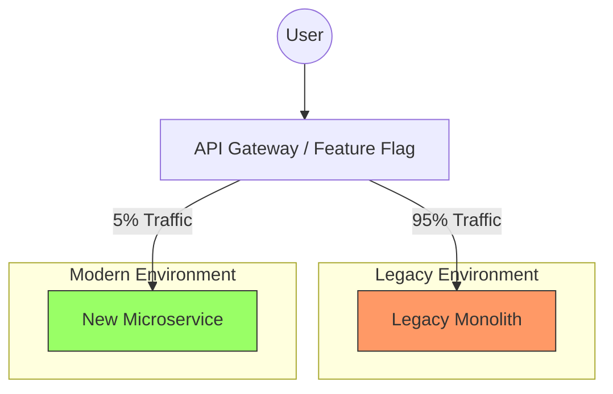
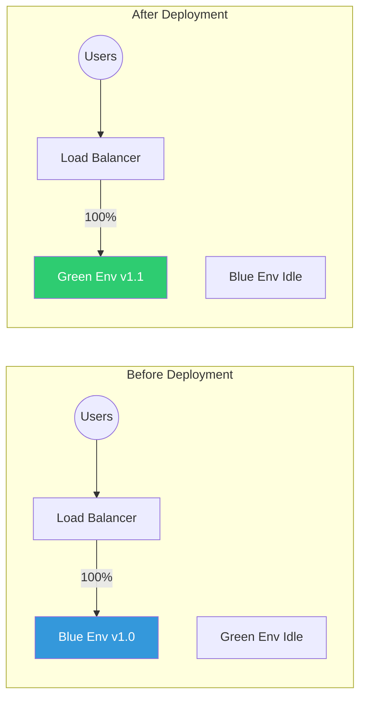
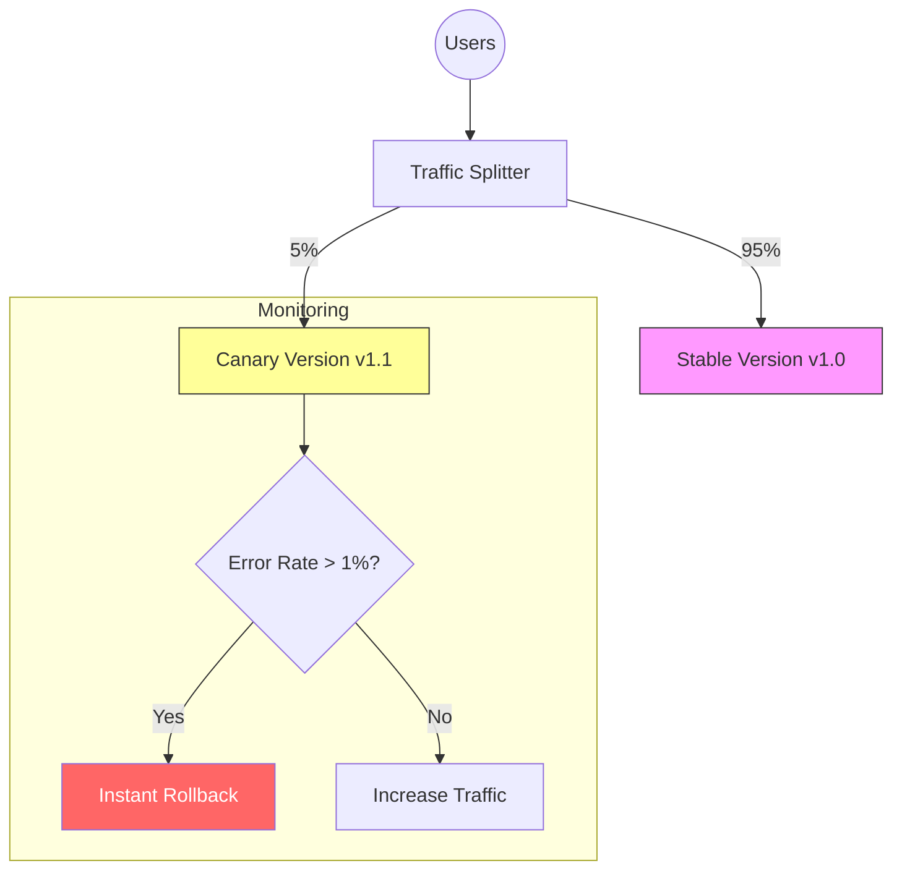

# Safe Feature Addition: Ship Without Breaking

## What This Does

Guides you through adding new features to existing production software using industry-proven patterns that protect current functionality. Implements additive development philosophy, feature flag strategies, modern deployment techniques (canary, blue-green), and refactoring patterns (Strangler Fig, Branch by Abstraction) used by top engineering teams.

### 🧰 Production Toolkit Assets
This skill is supported by a comprehensive toolkit located in the `production/safe-feature-addition/` directory:
-   **[verify-flags.js](./scripts/verify-flags.js)**: scan your codebase for feature flag consistency.
-   **[canary-rollout.sh](./scripts/canary-rollout.sh)**: Template for managing gradual traffic shifts.
-   **[Examples Library](./examples/)**: Runnable implementations of the patterns described below.
-   **[README.md](./README.md)**: Toolkit overview and quick start guide.

## When To Use This

- Adding features to existing production applications
- Refactoring legacy code without breaking it
- Planning feature rollouts with minimal risk
- Setting up CI/CD pipelines for safe deployment
- Migrating to new architectures incrementally
- Need to ship features while code is incomplete
- Working in Agile/Scrum teams with rapid iterations

## Core Philosophy: Additive Over Destructive

**Golden Rule:** Make additive changes rather than modifying existing systems. Add new optional parameters, endpoints, components, or database fields instead of changing what already exists. Your existing code continues working while new functionality lives alongside it.

### Why This Matters

- **Backward compatibility preserved** - Existing users unaffected
- **Rollback is instant** - Just disable the new code path
- **Parallel development** - Multiple teams work without conflicts
- **Incremental testing** - Validate gradually vs. big bang

**Example:**
```javascript
// ❌ DESTRUCTIVE - Breaks existing code
function processPayment(amount) {
  return cryptoPayment(amount);  // Old credit card users broken!
}

// ✅ ADDITIVE - Existing code untouched
function processPayment(amount, method = 'creditCard') {
  if (method === 'crypto') {
    return cryptoPayment(amount);  // NEW
  }
  return creditCardPayment(amount);  // EXISTING (unchanged)
}
```

## Instructions

### Step 1: Choose Your Development Strategy

Select the approach that fits your feature complexity and team structure:

#### Option A: Trunk-Based Development (RECOMMENDED for small teams)

**What it is:** Commit directly to main branch with short-lived feature branches (<1 day). Integrate frequently, catch errors quickly through automated tests.

**When to use:**
- Team size: 1-10 developers
- Feature complexity: Low to medium
- Deployment frequency: Multiple times per day
- Risk tolerance: Medium (mitigated by feature flags)

**Workflow:**
```bash
# Morning: Branch off main
git checkout -b feature/add-crypto-payment

# By end of day: Merge back
git checkout main
git merge feature/add-crypto-payment
git push origin main
```

**Key practices:**
- Feature flags wrap ALL new code (deploy dormant, activate later)
- Automated tests run on every commit
- Broken builds block all merges
- Commit frequently (every 2-4 hours)

**Benefits:**
- Simpler merges, fewer conflicts
- Faster feedback loops
- Continuous integration catches issues immediately
- Reduces merge hell from long-lived branches

#### Option B: Feature Branch Development (For larger teams/complex features)

**What it is:** Long-lived branches (days/weeks) for each feature. Developers work independently until stable, then merge back.

**When to use:**
- Team size: 10+ developers
- Feature complexity: High (multi-week development)
- Parallel development: Multiple major features simultaneously
- Risk tolerance: Low (main branch must always be stable)

**Workflow:**
```bash
# Create feature branch (lives for days/weeks)
git checkout -b feature/real-time-collaboration

# Regular syncs from main to avoid conflicts
git fetch origin main
git merge origin main

# Merge back when fully tested and stable
git checkout main
git merge feature/real-time-collaboration
```

**Key practices:**
- Main branch always deployable
- Feature branches live 1-2 weeks maximum
- Daily syncs from main to feature branch
- Full regression testing before merge

**Benefits:**
- Main branch stability guaranteed
- Parallel development at scale
- Features ship when ready, not rushed
- Easier to manage large teams

#### Choosing: Trunk-Based vs Feature Branches

| Factor | Trunk-Based | Feature Branches |
|--------|-------------|------------------|
| Team size | 1-10 | 10+ |
| Deploy frequency | Daily/multiple | Weekly |
| Feature duration | Hours-1 day | Days-weeks |
| CI/CD maturity | High (required) | Medium |
| Merge complexity | Low | Medium-High |
| Main branch risk | Medium* | Low |

*Mitigated with feature flags and strong CI

### Step 2: Implement Feature Flags (Critical for Safety)

Feature flags wrap new code in conditionals, letting you deploy to production while keeping features hidden until ready.

#### Basic Implementation

> [!TIP]
> Use the **[verify-flags.js](./scripts/verify-flags.js)** script to ensure all flags used in your code are properly defined in your configuration files before deployment.

**JavaScript/TypeScript:**
```typescript
// Simple flag check
if (featureFlags.isEnabled('newDashboard', userId)) {
  return <NewDashboard />;  // NEW CODE
}
return <OldDashboard />;    // EXISTING CODE (unchanged)
```

**Python:**
```python
def get_dashboard(user_id):
    if feature_flags.is_enabled('new_dashboard', user_id):
        return new_dashboard_view()  # NEW
    return legacy_dashboard_view()   # EXISTING
```

**Backend API:**
```javascript
app.get('/api/dashboard', (req, res) => {
  const useNewVersion = featureFlags.check('new_dashboard', req.user.id);
  
  if (useNewVersion) {
    return newDashboardHandler(req, res);  // NEW
  }
  return legacyDashboardHandler(req, res); // EXISTING
});
```

#### Configuration-Based Flags

```yaml
# config/feature-flags.yml
new_dashboard:
  enabled: false                    # Global kill switch
  environments: [development, staging]  # Only active in these envs
  rollout_percentage: 0             # 0% of production traffic
  enabled_users: []                 # Specific user IDs (for testing)
  enabled_companies: []             # Company-level access
  start_date: 2026-02-15            # Auto-enable on date
  end_date: null                    # Auto-disable on date (A/B tests)
```

#### Advanced: Gradual Rollout

```javascript
// Progressive rollout by percentage
function isFeatureEnabled(flagName, userId) {
  const config = featureFlags.getConfig(flagName);
  
  // 1. Check global kill switch
  if (!config.enabled) return false;
  
  // 2. Check environment
  if (!config.environments.includes(process.env.NODE_ENV)) {
    return false;
  }
  
  // 3. Check specific user override
  if (config.enabled_users.includes(userId)) return true;
  
  // 4. Check percentage rollout
  const userHash = hashUserId(userId);
  const bucket = userHash % 100;
  return bucket < config.rollout_percentage;
}

// Usage: Gradually increase rollout_percentage from 0 → 100
```

#### Feature Flag Platforms (Production-Ready)

**LaunchDarkly (Enterprise):**
```javascript
import LaunchDarkly from 'launchdarkly-node-server-sdk';

const client = LaunchDarkly.init(LAUNCHDARKLY_SDK_KEY);

app.get('/dashboard', async (req, res) => {
  const user = { key: req.user.id, email: req.user.email };
  const showNew = await client.variation('new-dashboard', user, false);
  
  if (showNew) {
    return newDashboard(req, res);
  }
  return oldDashboard(req, res);
});
```

**Alternatives:**
- **Unleash** (Open source, self-hosted)
- **Flagsmith** (Open source + managed)
- **Split.io** (Enterprise)
- **Custom solution** (Simple key-value store)

#### Feature Flag Best Practices

**DO:**
- ✅ Remove flags once feature is 100% rolled out (technical debt)
- ✅ Set expiration dates on flags
- ✅ Use descriptive flag names: `enable_crypto_payments` not `flag_42`
- ✅ Document what each flag controls
- ✅ Test both code paths (flag ON and OFF)

**DON'T:**
- ❌ Leave flags in code forever (clean up after 30 days at 100%)
- ❌ Nest flags more than 2 levels deep (complexity explosion)
- ❌ Use flags for permanent configuration (use config files)
- ❌ Skip monitoring flag evaluation performance

### Step 3: Advanced Refactoring Patterns

For major changes, use these proven architectural patterns:

#### Pattern A: Strangler Fig Pattern (System Migrations)

**When to use:** Replacing major systems, migrating architectures, modernizing legacy applications incrementally.

**How it works:** Build new functionality alongside old code, gradually routing traffic to new implementation until legacy code can be removed.

**Example: Migrating from Monolith to Microservices**
> [!NOTE]
> See a runnable Node.js implementation in **[examples/strangler-fig/gateway.js](./examples/strangler-fig/gateway.js)**.



**Migration Phases:**

1.  **Phase 1: Setup Routing Layer**: Introduce a proxy or gateway.
2.  **Phase 2: Route Traffic**: Use a feature flag to send a small % to the new service.
3.  **Phase 3: Gradual Migration**: Week 1 (5%) → Week 2 (25%) → Week 3 (100%).
4.  **Phase 4: Remove Old Code**: Delete the legacy path once stable.

**Benefits:**
- Validate architecture in production early
- Learn from mistakes quickly (fail fast)
- Deliver continuous value during transformation
- Dynamically adjust migration priority
- Pause for urgent feature work

**Real-world example:**
*Martin Fowler's team used this to migrate a legacy .NET monolith to Node.js microservices over 18 months, keeping the system running the entire time.*

#### Pattern B: Branch by Abstraction (Component Replacement)

**When to use:** Replacing significant components (databases, APIs, frameworks) without breaking the system.

**How it works:** Introduce abstraction layer both old and new implementations satisfy. Gradually migrate callers to abstraction, then swap implementations.

**Example: Switching from REST to GraphQL**
> [!NOTE]
> See a concrete patterns in **[examples/branch-by-abstraction/DataStore.ts](./examples/branch-by-abstraction/DataStore.ts)**.

```javascript
// Step 1: Create abstraction
class DataFetcher {
  async getUser(id) {
    throw new Error('Must implement');
  }
}

// Step 2: Old implementation
class RESTDataFetcher extends DataFetcher {
  async getUser(id) {
    return fetch(`/api/users/${id}`).then(r => r.json());
  }
}

// Step 3: New implementation
class GraphQLDataFetcher extends DataFetcher {
  async getUser(id) {
    return graphqlClient.query({ query: GET_USER, variables: { id } });
  }
}

// Step 4: Use abstraction everywhere
const dataFetcher = featureFlags.useGraphQL 
  ? new GraphQLDataFetcher()
  : new RESTDataFetcher();

// All code uses abstraction
const user = await dataFetcher.getUser(userId);  // Works with both!

// Step 5: Flip feature flag when ready
// Step 6: Remove REST implementation once stable
```

**Migration steps:**
1. Extract interface/abstraction
2. Make old code implement interface
3. Switch all callers to interface
4. Build new implementation behind same interface
5. Use feature flag to switch implementations
6. Remove old code when new is proven

**Benefits:**
- System works at every step
- Rollback is instant (flip flag)
- Test both implementations in production
- Team can continue feature work during migration

### Step 4: Setup CI/CD Pipeline

Automate testing and deployment to catch issues before users see them.

#### Continuous Integration (CI)

**Required components:**
```yaml
# .github/workflows/ci.yml (GitHub Actions example)
name: Continuous Integration

on: [push, pull_request]

jobs:
  test:
    runs-on: ubuntu-latest
    steps:
      - uses: actions/checkout@v3
      
      - name: Install dependencies
        run: npm install
      
      - name: Run linter
        run: npm run lint
      
      - name: Run unit tests
        run: npm test
      
      - name: Run integration tests
        run: npm run test:integration
      
      - name: Check code coverage
        run: npm run coverage
        # Fail if coverage < 80%
      
      - name: Build application
        run: npm run build
      
      - name: Run security scan
        run: npm audit

  # Block merge if any step fails
```

**CI best practices:**
- Tests run on EVERY commit
- Broken builds block ALL merges
- Fast feedback (<10 minutes total)
- Parallel test execution
- Fail fast (stop at first error)

#### Continuous Delivery vs Deployment

**Continuous Delivery (Manual release):**
```yaml
# .github/workflows/cd.yml
deploy-staging:
  runs-on: ubuntu-latest
  steps:
    - name: Deploy to staging
      run: ./deploy.sh staging
    # Automatically deploys to staging
    # Waits for manual approval before production

deploy-production:
  needs: deploy-staging
  runs-on: ubuntu-latest
  environment: production  # Requires manual approval
  steps:
    - name: Deploy to production
      run: ./deploy.sh production
```

**Continuous Deployment (Automatic release):**
```yaml
deploy:
  if: github.ref == 'refs/heads/main'
  steps:
    - name: Deploy to production
      run: ./deploy.sh production
    # Automatically deploys when tests pass
    # No human approval needed
```

**Choose based on:**
- **Continuous Delivery**: Regulated industries, B2B enterprise, need approval gates
- **Continuous Deployment**: B2C products, high-trust teams, mature testing

#### Key Principles for Reliable CI/CD

1. **Architect for iterative releases** - Small, frequent deployments
2. **Test-driven development** - Write tests before code
3. **Work in small iterations** - Feature branches <1 day
4. **Use feature flags** - Deploy incomplete work safely
5. **Maintain staging environments** - Mirror production exactly
6. **One-click deployments** - Self-service, no manual steps

### Step 5: Choose Deployment Strategy

Select how you roll out to production:

#### Strategy A: Blue-Green Deployment (Zero-Downtime Switches)

**How it works:** Two identical production environments. Blue (current), Green (new version). Switch traffic 100% from Blue to Green instantly once validated.



**Implementation (AWS):**
```bash
# Deploy to Green environment
aws deploy create-deployment \
  --application-name MyApp \
  --deployment-group-name Green-Fleet \
  --s3-location bucket=my-app,key=v1.1.0.zip

# Test Green environment
curl https://green.myapp.com/health

# Switch traffic (instant)
aws elbv2 modify-listener \
  --listener-arn $LISTENER_ARN \
  --default-actions TargetGroupArn=$GREEN_TARGET_GROUP

# Rollback if issues (instant)
aws elbv2 modify-listener \
  --listener-arn $LISTENER_ARN \
  --default-actions TargetGroupArn=$BLUE_TARGET_GROUP
```

**When to use:**
- Need zero-downtime deployments
- Must validate thoroughly before users see
- Want instant rollback capability
- Have infrastructure capacity for 2x environments

**Pros:**
- ✅ Zero downtime
- ✅ Instant rollback (just switch back)
- ✅ Full testing before users affected
- ✅ Clean separation of versions

**Cons:**
- ❌ Requires 2x infrastructure (costly)
- ❌ Database migrations tricky (both versions must work)
- ❌ Doesn't catch issues with specific user segments

#### Strategy B: Canary Deployment (Gradual Rollouts)

**How it works:** Traffic gradually shifts from old to new version over minutes/hours/days. Deploy to small subset first, monitor, then incrementally roll out to everyone.

> [!TIP]
> Use the **[canary-rollout.sh](./scripts/canary-rollout.sh)** script as a starting point for automating this process in your CI/CD pipeline.



**Implementation (Kubernetes):**
```yaml
# deployment-canary.yml
apiVersion: apps/v1
kind: Deployment
metadata:
  name: myapp-canary
spec:
  replicas: 1  # 5% of traffic
  template:
    metadata:
      labels:
        app: myapp
        version: v1.1.0
        track: canary
    spec:
      containers:
      - name: myapp
        image: myapp:v1.1.0

# Service routes to both stable and canary
apiVersion: v1
kind: Service
metadata:
  name: myapp
spec:
  selector:
    app: myapp  # Matches both stable and canary
```

**Gradual rollout script:**
```bash
#!/bin/bash
# Canary rollout with monitoring

deploy_canary() {
  local percentage=$1
  echo "Deploying to ${percentage}% of users..."
  
  # Adjust replica counts for desired percentage
  kubectl scale deployment myapp-stable --replicas=$((100 - percentage))
  kubectl scale deployment myapp-canary --replicas=$percentage
  
  # Wait for rollout
  kubectl rollout status deployment/myapp-canary
  
  # Monitor for 10 minutes
  echo "Monitoring metrics..."
  sleep 600
  
  # Check error rates
  error_rate=$(get_error_rate)
  if (( $(echo "$error_rate > 0.05" | bc -l) )); then
    echo "Error rate too high! Rolling back..."
    kubectl scale deployment myapp-canary --replicas=0
    exit 1
  fi
  
  echo "${percentage}% rollout successful"
}

# Gradual rollout schedule
deploy_canary 5   # Day 1
deploy_canary 25  # Day 2
deploy_canary 50  # Day 3
deploy_canary 100 # Day 4

# Cleanup old version
kubectl delete deployment myapp-stable
```

**When to use:**
- Want to catch issues before affecting everyone
- Have good monitoring/observability
- Can tolerate some users on different versions
- Deploying high-risk changes

**Pros:**
- ✅ Detects problems early (limited blast radius)
- ✅ Real production validation
- ✅ Data-driven rollout decisions
- ✅ Lower infrastructure cost than blue-green

**Cons:**
- ❌ More complex traffic routing
- ❌ Users on different versions simultaneously
- ❌ Slower rollout (days vs minutes)
- ❌ Requires robust monitoring

#### Comparison: Blue-Green vs Canary

| Factor | Blue-Green | Canary |
|--------|-----------|--------|
| Rollout speed | Instant (100% at once) | Gradual (hours/days) |
| Risk | Medium | Low |
| Infrastructure cost | High (2x) | Low (1.1x) |
| Rollback | Instant | Fast |
| Monitoring requirements | Medium | High |
| Complexity | Low | Medium-High |
| Best for | Low-risk changes | High-risk changes |

**Recommendation:** Use **Canary for major features** (new payment method, architecture changes). Use **Blue-Green for minor updates** (bug fixes, UI tweaks).

### Step 6: Refactor Legacy Code Safely

When adding features requires touching old code:

#### Start with Low-Risk Changes

Build confidence and understanding before major refactors:

**Phase 1: Clarity improvements (Zero risk)**
```javascript
// Before: Magic numbers and unclear names
function calc(x, y) {
  return x * y * 0.85;
}

// After: Named constants and clear intent
const TAX_MULTIPLIER = 0.85;

function calculateTotalWithTax(subtotal, taxRate) {
  return subtotal * taxRate * TAX_MULTIPLIER;
}
```

**Phase 2: Extract functions (Low risk)**
```javascript
// Before: Long method doing multiple things
function processOrder(order) {
  // Validate (20 lines)
  if (!order.items) throw new Error('No items');
  // ... validation logic
  
  // Calculate total (15 lines)
  let total = 0;
  for (let item of order.items) {
    total += item.price * item.quantity;
  }
  // ... calculation logic
  
  // Save to database (25 lines)
  // ... database logic
}

// After: Focused functions
function processOrder(order) {
  validateOrder(order);
  const total = calculateTotal(order);
  saveOrder(order, total);
}

function validateOrder(order) {
  if (!order.items) throw new Error('No items');
  // ... validation logic
}

function calculateTotal(order) {
  return order.items.reduce((sum, item) => 
    sum + (item.price * item.quantity), 0
  );
}

function saveOrder(order, total) {
  // ... database logic
}
```

**Phase 3: Add tests before changing behavior**
```javascript
// BEFORE refactoring, write tests
describe('calculateTotal', () => {
  it('calculates total for single item', () => {
    const order = { items: [{ price: 10, quantity: 2 }] };
    expect(calculateTotal(order)).toBe(20);
  });
  
  it('calculates total for multiple items', () => {
    const order = { 
      items: [
        { price: 10, quantity: 2 },
        { price: 5, quantity: 3 }
      ]
    };
    expect(calculateTotal(order)).toBe(35);
  });
  
  // Tests act as safety net during refactor
});
```

#### Establish Safety Nets

**Coverage analysis:**
```bash
# Check current test coverage
npm run coverage

# Output shows gaps:
# calculateTotal: 85% coverage ✅
# validateOrder: 40% coverage ⚠️  
# saveOrder: 10% coverage ❌

# Write tests for uncovered code BEFORE refactoring
```

**Characterization tests** (for legacy code without tests):
```javascript
// Don't know what this does, but capture current behavior
test('legacy calculateDiscount behavior', () => {
  // Run function with various inputs
  expect(calculateDiscount(100, 'GOLD')).toBe(15);
  expect(calculateDiscount(50, 'SILVER')).toBe(5);
  expect(calculateDiscount(200, 'BRONZE')).toBe(10);
  
  // Now refactor knowing tests will catch changes
});
```

#### Avoid Complete Rewrites

**Why rewrites fail:**
- Take 2-3x longer than estimated
- Introduce new bugs
- Lose subtle business logic from original code
- Team knowledge loss
- Opportunity cost (features not built)

**Instead: Incremental improvement**
```
❌ Big Bang Rewrite (18 months):
├─ Month 0-6: Analysis and planning
├─ Month 6-15: Building new system
├─ Month 15-18: Migration and bug fixes
└─ Result: High risk, delayed value

✅ Incremental Refactor (18 months):
├─ Month 1: Refactor authentication (Ship!)
├─ Month 2: Refactor payment processing (Ship!)
├─ Month 3: Refactor user management (Ship!)
├─ Month 4-18: Continue module by module (Ship each month!)
└─ Result: Continuous value, lower risk
```

### Step 7: Testing Strategy (Non-Negotiable)

Test at multiple levels to catch issues before users:

#### Test Pyramid

```
       /\
      /  \     E2E Tests (5%)
     /____\    - Full user workflows
    /      \   - UI + Backend + Database
   /        \  Integration Tests (20%)
  /          \ - API contracts
 /            \- Service interactions
/______________\ Unit Tests (75%)
                - Pure functions
                - Business logic
```

**Implementation:**

**Unit Tests (Fast, isolated, many)**
```javascript
// test/calculateTotal.test.js
describe('calculateTotal', () => {
  it('handles empty cart', () => {
    expect(calculateTotal([])).toBe(0);
  });
  
  it('applies discount correctly', () => {
    const items = [{ price: 100, quantity: 1 }];
    const discount = 0.1;
    expect(calculateTotal(items, discount)).toBe(90);
  });
  
  // Run in milliseconds, hundreds of tests
});
```

**Integration Tests (Medium speed, real interactions)**
```javascript
// test/payment-flow.integration.test.js
describe('Payment Processing', () => {
  it('creates order and processes payment', async () => {
    // Use test database
    const order = await createOrder({ items: [...] });
    
    // Call real payment service (test mode)
    const payment = await processPayment(order.id, {
      method: 'creditCard',
      token: TEST_CARD_TOKEN
    });
    
    expect(payment.status).toBe('succeeded');
    expect(order.status).toBe('paid');
  });
  
  // Run in seconds, tens of tests
});
```

**End-to-End Tests (Slow, full system, few)**
```javascript
// test/checkout.e2e.test.js
describe('Checkout Flow', () => {
  it('completes full purchase', async () => {
    // Browser automation (Playwright/Cypress)
    await page.goto('/products');
    await page.click('[data-testid="add-to-cart"]');
    await page.goto('/checkout');
    await page.fill('[name="cardNumber"]', '4242424242424242');
    await page.click('[data-testid="submit-payment"]');
    
    await expect(page).toHaveURL('/order-confirmation');
    await expect(page.locator('.success-message')).toBeVisible();
  });
  
  // Run in minutes, single-digit tests
});
```

#### Regression Testing (Critical)

**Automated regression suite:**
```bash
#!/bin/bash
# Must pass before ANY deployment

echo "Running regression tests..."

# Unit tests
npm test

# Integration tests  
npm run test:integration

# E2E tests
npm run test:e2e

# All must pass
if [ $? -ne 0 ]; then
  echo "❌ Regression tests FAILED"
  echo "New feature breaks existing functionality"
  echo "DO NOT DEPLOY"
  exit 1
fi

echo "✅ All regression tests passed"
```

**Pre-merge checklist:**
- [ ] All existing unit tests pass (100%)
- [ ] All integration tests pass (100%)
- [ ] E2E critical paths pass (100%)
- [ ] No performance degradation (benchmark)
- [ ] Code coverage maintained or improved

### Step 8: Monitoring & Rollback

Deploy with confidence knowing you can revert instantly:

#### Real-Time Monitoring

**Key metrics to watch:**
```javascript
// Datadog / New Relic example
const metrics = {
  // Error rates (should stay flat)
  error_rate: 0.01,           // 1% baseline
  error_rate_threshold: 0.05,  // Alert if >5%
  
  // Latency (should not increase)
  p50_latency: 120,   // ms
  p95_latency: 450,   // ms
  p99_latency: 800,   // ms
  
  // Throughput (should not drop)
  requests_per_second: 1200,
  
  // Business metrics
  conversion_rate: 0.034,     // 3.4%
  checkout_completion: 0.78,  // 78%
};

// Alert if any metric crosses threshold
if (current.error_rate > metrics.error_rate_threshold) {
  rollback('Error rate spike detected');
}
```

**Automated rollback triggers:**
```yaml
# rollback-rules.yml
triggers:
  - metric: error_rate
    threshold: 0.05      # 5%
    duration: 5m         # Sustained for 5 minutes
    action: rollback
    
  - metric: p95_latency
    threshold: 1000      # 1 second
    duration: 10m
    action: rollback
    
  - metric: conversion_rate
    threshold: -0.20     # 20% drop
    duration: 15m
    action: rollback
```

#### Instant Rollback Procedures

**Feature flag rollback (FASTEST):**
```bash
# Single command, instant effect
curl -X POST https://api.launchdarkly.com/flags/new-checkout \
  -H "Authorization: Bearer $API_KEY" \
  -d '{"enabled": false}'

# Users immediately see old version
# No deployment needed
```

**Code rollback (Fast):**
```bash
# Revert last deployment
git revert HEAD
git push origin main

# Trigger deployment
./deploy.sh production

# Takes 5-10 minutes (build + deploy time)
```

**Infrastructure rollback (Blue-Green):**
```bash
# Switch load balancer back to Blue environment
aws elbv2 modify-listener \
  --listener-arn $LISTENER_ARN \
  --default-actions TargetGroupArn=$BLUE_TARGET_GROUP

# Takes seconds
```

**Database rollback (SLOWEST, avoid if possible):**
```bash
# Run DOWN migration
python manage.py migrate app_name zero

# Restore from backup if data corruption
pg_restore -d production backups/pre_deployment.dump

# Takes minutes to hours (avoid with feature flags)
```

## Real-World Workflow for VueMoney

Let's walk through adding cryptocurrency payments:

### Day 1: Planning & Setup

```bash
# 1. Branch off (trunk-based: merge by end of day)
git checkout -b feature/crypto-payments

# 2. Define scope
```
**Feature:** Accept Bitcoin/Ethereum payments  
**Problem:** Users want crypto payment option  
**Success:** 5% of checkouts use crypto within 30 days  
**Out of scope:** Other cryptocurrencies, crypto refunds (v2)

```bash
# 3. Setup feature flag
```
```yaml
# config/feature-flags.yml
crypto_payments:
  enabled: true
  environments: [development]
  rollout_percentage: 0
  enabled_users: [your_user_id]  # You can test immediately
```

### Day 1-2: Build Additively

```javascript
// payments/processPayment.js

// ✅ ADDITIVE - existing code untouched
async function processPayment(order, paymentMethod) {
  // NEW CODE - behind feature flag
  if (paymentMethod.type === 'crypto' && 
      featureFlags.isEnabled('crypto_payments', order.userId)) {
    return processCryptoPayment(order, paymentMethod);
  }
  
  // EXISTING CODE - completely unchanged
  return processCreditCardPayment(order, paymentMethod);
}

// NEW FILE - crypto logic isolated
// payments/crypto/processCryptoPayment.js
async function processCryptoPayment(order, paymentMethod) {
  const { currency, wallet } = paymentMethod;
  
  // Integrate with Coinbase Commerce API
  const charge = await coinbaseCommerce.createCharge({
    amount: order.total,
    currency: currency,  // BTC or ETH
    metadata: { orderId: order.id }
  });
  
  return {
    status: 'pending',
    paymentId: charge.id,
    hostedUrl: charge.hosted_url  // User completes payment here
  };
}
```

### Day 2: Test Thoroughly

```javascript
// tests/crypto-payment.test.js

describe('Crypto Payments', () => {
  it('processes Bitcoin payment', async () => {
    const order = createTestOrder();
    const result = await processPayment(order, {
      type: 'crypto',
      currency: 'BTC',
      wallet: 'test_wallet'
    });
    
    expect(result.status).toBe('pending');
    expect(result.hostedUrl).toBeDefined();
  });
  
  // CRITICAL: Test existing flow still works
  it('still processes credit cards (regression)', async () => {
    const order = createTestOrder();
    const result = await processPayment(order, {
      type: 'creditCard',
      token: 'test_token'
    });
    
    expect(result.status).toBe('succeeded');
  });
});

// Run all tests
npm test  // All existing + new tests must pass
```

### Day 2: Merge (End of Day)

```bash
# Push and merge to main (trunk-based)
git push origin feature/crypto-payments

# CI runs automatically
# ✅ All tests pass
# ✅ Build succeeds
# ✅ Deploy to staging

# Merge to main
git checkout main
git merge feature/crypto-payments
git push origin main

# Auto-deploys to production with feature flag OFF
```

### Week 1: Internal Testing

```yaml
# Enable for internal team
crypto_payments:
  enabled: true
  environments: [production]
  rollout_percentage: 0
  enabled_users: [team_member_ids]  # 10-15 people
```

**Test internally:**
- Make real crypto payments (small amounts)
- Verify order creation
- Check confirmation emails
- Test error handling (insufficient funds, expired payment)

### Week 2: Beta Rollout (5% of users)

```yaml
crypto_payments:
  enabled: true
  environments: [production]
  rollout_percentage: 5  # 5% of all users see option
```

**Monitor closely:**
```bash
# Watch error rates
datadog query "avg:app.payments.error_rate{feature:crypto}"

# Check conversion
datadog query "sum:app.payments.completed{method:crypto}"

# User feedback
SELECT * FROM support_tickets 
WHERE created_at > NOW() - INTERVAL '7 days'
AND message LIKE '%crypto%';
```

**Rollback trigger:**
```bash
# If error rate >5%, instant rollback
if [ $CRYPTO_ERROR_RATE -gt 0.05 ]; then
  echo "Rolling back crypto payments"
  feature-flag disable crypto_payments
fi
```

### Week 3-4: Progressive Rollout

```yaml
# Week 3: 25%
crypto_payments:
  rollout_percentage: 25

# Week 4: 50%
crypto_payments:
  rollout_percentage: 50
```

**Success indicators:**
- Error rate stays <2%
- 5% of checkouts use crypto
- Positive user feedback
- No impact on credit card conversion

### Week 5: Full Release (100%)

```yaml
crypto_payments:
  enabled: true
  rollout_percentage: 100
```

### Week 6: Cleanup

```javascript
// Remove feature flag after 30 days at 100%
async function processPayment(order, paymentMethod) {
  // Feature flag removed - now permanent
  if (paymentMethod.type === 'crypto') {
    return processCryptoPayment(order, paymentMethod);
  }
  return processCreditCardPayment(order, paymentMethod);
}
```

## Troubleshooting

### Issue: Tests Failing After Feature Added

**Symptoms:**
```bash
npm test
# FAIL tests/checkout.test.js
# Expected: 200 status
# Received: 500 error
```

**Root cause:** New code has side effects on existing functionality

**Debug process:**
```bash
# 1. Isolate failing test
npm test -- tests/checkout.test.js --verbose

# 2. Check what changed
git diff main -- src/checkout.js

# 3. Common culprits:
# - Modified shared utility functions
# - Changed database schema
# - Altered global configuration
# - Modified API response format
```

**Solution:**
```javascript
// Problem: New code modified shared function
function calculateTotal(items, paymentMethod) {
  let total = items.reduce((sum, item) => sum + item.price, 0);
  
  // NEW CODE - breaks existing behavior
  if (paymentMethod === 'crypto') {
    total *= 1.02;  // 2% crypto fee
  }
  
  return total;
}

// Fix: Make additive, don't change existing behavior
function calculateTotal(items, paymentMethod = 'creditCard') {
  let total = items.reduce((sum, item) => sum + item.price, 0);
  
  // Only add fee for crypto, existing behavior unchanged
  if (paymentMethod === 'crypto') {
    total += applyCryptoFee(total);  // Separate function
  }
  
  return total;
}
```

### Issue: Performance Degradation

**Symptoms:**
```bash
# Monitoring alert
🚨 P95 latency increased from 300ms to 1200ms
🚨 Users reporting slow checkout
```

**Debug process:**
```bash
# 1. Identify bottleneck
# Use APM tool (New Relic, Datadog)
# Shows: Database query taking 800ms

# 2. Check query logs
tail -f /var/log/postgres/queries.log

# Found: N+1 query problem
# SELECT * FROM orders WHERE id = ?
# SELECT * FROM items WHERE order_id = ?  # Runs 20 times!
# SELECT * FROM items WHERE order_id = ?
# ...
```

**Solution:**
```javascript
// Problem: N+1 queries
async function getOrderDetails(orderId) {
  const order = await db.query('SELECT * FROM orders WHERE id = ?', [orderId]);
  
  // ❌ Runs query for each item separately
  for (let itemId of order.itemIds) {
    const item = await db.query('SELECT * FROM items WHERE id = ?', [itemId]);
    order.items.push(item);
  }
  
  return order;
}

// Fix: Single query with JOIN
async function getOrderDetails(orderId) {
  const order = await db.query(`
    SELECT o.*, 
           json_agg(i.*) as items
    FROM orders o
    LEFT JOIN items i ON i.order_id = o.id
    WHERE o.id = ?
    GROUP BY o.id
  `, [orderId]);
  
  return order;
}

// Latency: 1200ms → 150ms
```

**Prevention:**
```javascript
// Add performance test
test('getOrderDetails performance', async () => {
  const start = Date.now();
  await getOrderDetails(testOrderId);
  const duration = Date.now() - start;
  
  expect(duration).toBeLessThan(200);  // Fail if >200ms
});
```

### Issue: Feature Flag Not Working in Production

**Symptoms:**
- Flag enabled in config but users don't see feature
- Inconsistent behavior (works sometimes, not others)

**Debug:**
```bash
# 1. Check flag status
curl https://api.yourapp.com/debug/feature-flags

# 2. Verify environment
echo $NODE_ENV  # Should be "production"

# 3. Check cache
redis-cli GET "feature_flag:crypto_payments"

# 4. Check logs
tail -f logs/production.log | grep "crypto_payments"
```

**Common causes:**

**Cache not refreshed:**
```javascript
// Problem: Flag cached, changes not reflected
const flags = cache.get('feature_flags');  // Stale data

// Fix: Cache with TTL
const flags = cache.get('feature_flags', { ttl: 60 });  // Refresh every 60s

// Or: Bust cache on update
function updateFeatureFlag(name, value) {
  database.updateFlag(name, value);
  cache.delete('feature_flags');  // Force refresh
}
```

**Environment mismatch:**
```yaml
# Config says only staging
crypto_payments:
  environments: [staging]  # ❌ Not in production!

# Fix: Add production
crypto_payments:
  environments: [staging, production]
```

### Issue: Database Migration Problems

**Symptoms:**
```bash
# Migration runs
python manage.py migrate

# But existing queries break
django.db.utils.OperationalError: column "crypto_wallet" does not exist
```

**Root cause:** Old code deployed, new schema applied (timing issue)

**Solution: Backward-compatible migrations**
```python
# ❌ BREAKS existing code
class Migration:
    operations = [
        migrations.RenameColumn('User', 'wallet', 'crypto_wallet'),
    ]
# Old code expects 'wallet', crashes immediately

# ✅ SAFE: Multi-phase migration
# Phase 1: Add new column (keep old)
class Migration_001:
    operations = [
        migrations.AddField('User', 'crypto_wallet', nullable=True),
    ]
# Both old and new code work

# Phase 2: Backfill data
UPDATE users SET crypto_wallet = wallet WHERE crypto_wallet IS NULL;

# Phase 3: Update code to use new column
# Deploy new code

# Phase 4: Remove old column (weeks later)
class Migration_002:
    operations = [
        migrations.RemoveField('User', 'wallet'),
    ]
```

**Rollback safety:**
```bash
# Always test rollback BEFORE running migration
python manage.py migrate app_name 001  # Apply
python manage.py migrate app_name zero  # Rollback
python manage.py migrate app_name 001  # Re-apply

# If rollback works, safe to run in production
```

## Checklists

### Pre-Development Checklist

- [ ] Feature clearly defined (problem, solution, success criteria)
- [ ] Development strategy chosen (trunk-based vs feature branches)
- [ ] Feature flag configured
- [ ] Deployment strategy selected (canary vs blue-green)
- [ ] Testing approach planned
- [ ] Rollback procedure documented
- [ ] Monitoring alerts configured

### Development Checklist

- [ ] New code behind feature flag
- [ ] Changes are additive, not destructive
- [ ] Existing code untouched (or minimal changes)
- [ ] Unit tests written for new code
- [ ] Integration tests cover new + old interaction
- [ ] All regression tests passing (100%)
- [ ] Code reviewed by team
- [ ] Documentation updated

### Pre-Deployment Checklist

- [ ] Feature flag set to 0% rollout
- [ ] CI/CD pipeline passing (all tests green)
- [ ] Staging environment tested manually
- [ ] Performance benchmarks acceptable
- [ ] Database migrations backward-compatible
- [ ] Monitoring dashboard configured
- [ ] Rollback procedure tested
- [ ] Team notified of deployment

### Post-Deployment Checklist

- [ ] Monitoring error rates (should stay flat)
- [ ] Monitoring latency (should not increase)
- [ ] Monitoring business metrics
- [ ] Gradual rollout schedule followed (5% → 25% → 50% → 100%)
- [ ] User feedback collected
- [ ] Support team briefed on new feature
- [ ] Ready to rollback if issues arise
- [ ] Feature flag cleanup scheduled (30 days after 100%)

## Key Takeaways

**Philosophy:**
- ✅ Make additive changes, not destructive modifications
- ✅ Existing code continues working while new features added alongside
- ✅ Backward compatibility is sacred

**Development:**
- ✅ Use feature flags to deploy code before it's ready
- ✅ Trunk-based development for small teams, feature branches for large teams
- ✅ Integrate frequently (at least daily)
- ✅ Strangler Fig Pattern for system migrations
- ✅ Branch by Abstraction for component replacements

**Testing:**
- ✅ Test pyramid: 75% unit, 20% integration, 5% E2E
- ✅ Regression tests must pass 100% (non-negotiable)
- ✅ Write tests before refactoring legacy code
- ✅ Avoid complete rewrites (incremental improvement instead)

**Deployment:**
- ✅ Canary deployments for high-risk changes
- ✅ Blue-green for low-risk, instant rollback
- ✅ Deploy incrementally (5% → 25% → 50% → 100%)
- ✅ Monitor closely, ready to rollback instantly

**Rollback:**
- ✅ Feature flags enable instant rollback (no deployment)
- ✅ Always have rollback procedure tested and ready
- ✅ Automated rollback triggers based on metrics
- ✅ Database migrations must be backward-compatible

## Recommended Methodologies

For **VueMoney** (fintech startup):

**Development:** Agile with Scrum  
- 2-week sprints
- Daily standups
- Sprint reviews and retrospectives
- 86% of software teams use Agile (industry standard)

**Version Control:** Trunk-Based Development  
- Merge to main daily
- Feature flags for incomplete work
- Fast feedback, fewer merge conflicts

**Deployment:** DevOps with CI/CD  
- Automated testing on every commit
- Continuous delivery to staging
- Continuous deployment to production (feature flagged)

**Rollout:** Canary Deployments  
- 5% → 25% → 50% → 100% over 2-4 weeks
- Monitor metrics closely
- Instant rollback capability

This combination gives you rapid iteration (Agile), safe deployments (feature flags + canary), and confidence (CI/CD + monitoring).

## Notes

- **87% of Agile teams use Scrum** - most battle-tested framework
- **Trunk-based development reduces merge conflicts by 60%** - faster integration
- **Feature flags enable 10x faster rollback** - vs code deployment
- **Canary deployments catch 95% of issues** - before affecting all users
- **Complete rewrites take 3x longer than estimated** - avoid at all costs
- **Blue-green requires 2x infrastructure** - budget accordingly
- **Remove feature flags after 30 days at 100%** - prevent technical debt

---

**Success = Features Ship Safely + Fast Rollback + Users Happy**

Based on industry best practices from companies like Netflix, Amazon, Google, Facebook, and Stripe.
